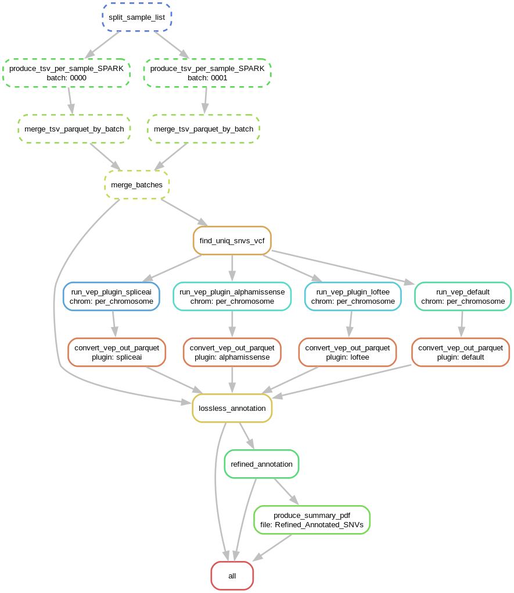

[](https://www.jacquemont-lab.org/)

[Git Repository SNV-Annotation](https://github.com/JacquemontLab/SNV-Annotation.git)

# Documentation of the SNV Annotation Pipeline

This repository contains a bioinformatics pipeline for annotating SNVs on large dataset (>100k vcf) using Ensembl’s Variant Effect Predictor (VEP).

The workflow is designed to run on different infrastructures. However, since these environments differ significantly in terms of write permissions, architecture, and security settings, we had to rewrite the workflow and some of the initial scripts. As a result, two distinct pipelines are available: one tailored for SPARK using a computing cluster, and another for UKBB using the UKB-RAP platform (see `setup` directory)


### 🔢 Pipeline Inputs

The pipeline requires **two input files** to be specified in the `config.json`.
Additionally, the pipeline works with compressed VCF files (`.vcf.gz`) that have been indexed with their corresponding `.vcf.gz.tbi` files.

#### 1. `list_sample.txt`

A plain text file listing the **sample IDs**, one per line.
The header `sampleID` is required.

**Example:**

```
sampleID
AXXXXX
BXXXXX
CXXXXX
DXXXXX
```

#### 2. `sample_paths.tsv.gz`

A **gzip-compressed, tab-separated file** that maps each `sampleID` to its corresponding file path.

**Example:**

```
sampleID	Path
AXXXXX	    /absolute/path/to/sample_A.vcf.gz
BXXXXX	    /absolute/path/to/sample_B.vcf.gz
CXXXXX	    /absolute/path/to/sample_C.vcf.gz
DXXXXX	    /absolute/path/to/sample_D.vcf.gz
```

> For the **SPARK\_iwesv3** dataset, each `sampleID` is expected to have **two entries**,
> one with **"deepvariant"** and one with **"gatk"** appearing **anywhere in the absolute path**.

Each sample appears **twice**, with different variant callsets:

```
sampleID	Path
SPARK_001	/data/SPARK_iwesv3/SPARK_001/deepvariant/SPARK_001.deepvariant.vcf.gz
SPARK_001	/data/SPARK_iwesv3/SPARK_001/gatk/SPARK_001.gatk.vcf.gz
SPARK_002	/data/SPARK_iwesv3/SPARK_002/deepvariant/SPARK_002.deepvariant.vcf.gz
SPARK_002	/data/SPARK_iwesv3/SPARK_002/gatk/SPARK_002.gatk.vcf.gz
SPARK_003	/data/SPARK_iwesv3/SPARK_003/deepvariant/SPARK_003.deepvariant.vcf.gz
SPARK_003	/data/SPARK_iwesv3/SPARK_003/gatk/SPARK_003.gatk.vcf.gz
```


> ⚠️ Ensure that every sample listed in `list_sample.txt` has at least one matching path in `sample_paths.tsv.gz`.


### ⚙️ Installation & Setup

All necessary pipeline prerequisites (e.g. reference genome, VEP cache, annotation resources, virtual environment setup) can be installed using the provided setup script:

```bash
bash setup.sh
```

This script performs the following tasks:

* Creates a Python virtual environment with required packages
* Downloads the reference genome (GRCh38 by default)
* Retrieves necessary annotation resources:

  * VEP cache
  * AlphaMissense data
  * LoFTEE plugin
  * SpliceAI scores
* Prepares the environment for downstream analysis


## Different Steps of the Pipeline
This repository provides a Snakemake-based workflow for processing and annotating SNVs on human reference genome version **GRCh38**.

### Workflow DAG
Below is a graphical representation of the workflow:



### Prerequisite to run the Snakefile pipeline: Downloading the Raw Data

gVCF files need to be available.
We do not use the pVCF files as they contain excessive information that is unnecessary for our purposes.

### 1. Splitting Sample List
The list of samples is split into batches to increase processing speed (**`split_sample_list`** step).

### 2. Filtering gVCF and taking intersection between callers if multiple are available (e.g., in the case of SPARK)

This step may need to be adapted depending on the dataset you are working with. For SPARK, it processes two VCF files per sample and retains only their intersection. In contrast, for UKBB, it processes a single VCF file per sample.


The gVCF files are filtered to retain only:

-   **Non Homozygous reference sites** — Removing `0/0` or `./.` to keep only variant sites.
  
  Some SNPs appear as `1/0` because they were originally multiallelic (e.g., `GT=2/3`) in the raw gVCF. After normalization, each alternate allele is represented separately, resulting in genotypes like `0/1` and `1/0`. As a result, the total depth (`DP`) may differ from the sum of `REF_AD` and `ALT_AD`.

-   **Indels**

-   **SNPs**

This corresponds to the **`produce_tsv_per_sample_SPARK`** step in Snakemake.

### 3. Merging TSV to Parquet

The merging is done in two steps:

1\. Batch merge (**`merge_tsv_parquet_by_batch`**)

2\. Merge of batches (**`merge_batches`**)

This approach enables parallelization and significantly increases speed. The output file is **`Unannotated_SNVs.parquet`**.

### 4. Identifying Unique SNVs

Unique SNVs are extracted to avoid redundant annotation during the VEP step.
The output consists of VCF files per chromosome, used for VEP annotation (**`find_uniq_snvs_vcf`** step).

### 5. VEP Annotation

Each chromosome's unique SNVs are annotated using **VEP**. Different annotations:

-   **Default VEP annotation**: Consequence, CANONICAL, MANE, MAX_AF, MAX_AF_POPS, gnomADe_, gnomADg_ (**`run_vep_default`**)

-   **LoFtee plugin**: LoF, LoF_filter, LoF_flags, LoF_info (**`run_vep_plugin_loftee`**)

-   **AlphaMissense plugin**: am_class, am_pathogenicity scores (**`run_vep_plugin_alphamissense`**)

-   **SpliceAI plugin**: SpliceAI_pred including SYMBOL\|DS_AG\|DS_AL\|DS_DG\|DS_DL\|DP_AG\|DP_AL\|DP_DG\|DP_DL (**`run_vep_plugin_spliceai`**)

### 6. Reformatting VEP Output

The VEP output is reformatted per plugin, for example **SpliceAI_pred** is split into separate columns, the maximum AF across gnomAD population is computed.
Only unique SNVs with an annotation of the given plugin are retained, reducing file size and computation time (**`convert_vep_out_parquet`** rule).

### 7. Creating a Lossless Annotation

This is the most resources consuming step, it merges **`Unannotated_SNVs.parquet`** with plugin annotations.
The output is **`snvDB_lossless.parquet`**, partitioned by chromosome (**`lossless_annotation`** rule).

To reduce the size of the database, we removed:

-   **SNVs where either MANE or CANONICAL annotation is not null**

### 8. Refining Annotation

This step filters data to generate a more relevant downstream dataset (**`refined_annotation`** rule). The dataset correspond to **`snvDB_refined.parquet`**.

Key processing steps:

-   **Compute Allele Count Ratio**: `AC_ratio = ALT_AD / DP`

-   **Compute Max_DS_SpliceAI**: `max(DS_AG, DS_AL, DS_DG, DS_DL)`

-   **Filter SNVs**: - DP \≥ 20 - GQ \≥ 30 - 0.2 \≤ AC_ratio \≤ 0.8

-   **Filter SNVs with Allele Frequency below 0.001**: - gnomAD_max_AF \≤ 0.001 and dataset_AF \≤ 0.001

-   **Identify Variant Types**:

if Consequence is `synonymous_variant` → **Synonymous**

if the first consequence is `stop_gained` → **Stop_Gained**

if the first consequence is `frameshift_variant` → **Frameshift**

if the first consequence is `splice_acceptor_variant` or `splice_donor_variant` → **Splice_variants**

if the first consequence is `missense_variant` → **Missense**

-   **Retain Variants Based on Criteria**:

**Synonymous**

**Stop_Gained** (LoF = HC , high-confidence LoF variants)

**Frameshift** (LoF = HC , high-confidence LoF variants)

**Splice_variants** (Max_DS_SpliceAI ≥ 0.8 , 'high precision')

**Missense** (am_pathogenicity ≥ 0.564 , 'likely_pathogenic')

## Output format of **`snvDB_refined.parquet`**


| Column name | Label | Description |
|------------------|------------------|------------------------------------|
| **SampleID** | Sample ID | Unique identifier for the sample. |
| **CHROM** | Chromosome | Chromosome where the variant is located. |
| **POS** | Position | Genomic position of the variant. |
| **REF** | Reference allele | Reference allele at the variant position. |
| **ALT** | Alternate allele | Alternate allele observed at the variant position. |
| **GT** | Genotype | Genotype of the individual for the variant, computed by Deepvariant. |
| **DP** | Read depth | Read depth supporting the variant call, computed by Deepvariant. |
| **GQ** | Genotype quality | Genotype quality score, computed by Deepvariant. |
| **REF_AD** | Reference allele read depth | Read count supporting the reference allele, computed by Deepvariant. |
| **ALT_AD** | Alternate allele read depth | Read count supporting the alternate allele, computed by Deepvariant. |
| **AC_ratio** | Allele count ratio | Allele count ratio of the alternate allele. `ALT_AD / DP` |
| **Gene** | Gene Ensembl stable ID | Ensembl stable ID of affected gene. |
| **Feature** | Transcript Ensembl stable ID | Ensembl stable ID of feature. |
| **CANONICAL** | Canonical Transcript | Transcript is the canonical. |
| **MANE** | Mane Transcript | Transcript is the MANE Select or MANE Plus Clinical transcript for the gene. |
| **dataset_AF** | Dataset Allele Frequency | Number of individual having the SNV (after QC filter) / number of total individuals in the dataset. |
| **gnomAD_max_AF** | Maximum allele frequency across gnomAD | Maximum AF across all gnomAD population (exome and genome). |
| **MAX_AF** | Maximum allele frequency across populations | Maximum observed allele frequency in 1000 Genomes, ESP and gnomAD. |
| **MAX_AF_POPS** | Populations with maximum allele frequency | Population in which was found MAX_AF. |
| **Variant_Type** | Type of variant | Functional impact classification of the variant. |
| **am_pathogenicity** | Probability of the variant being pathogenic | A continuous score between 0 and 1 which can be interpreted as the predicted probability of the variant being pathogenic, from AlphaMissense plugin. |
| **Max_DS_SpliceAI** | Maximum SpliceAI Delta Score | Maximum SpliceAI delta score for splicing impact. |

## More Documentation
Here are some useful links about the plugins used in this pipeline, provided by VEP (Variant Effect Predictor).

### VEP

[Ensembl VEP Options](https://useast.ensembl.org/info/docs/tools/vep/script/vep_options.html)\
[Ensembl VEP Plugins](https://useast.ensembl.org/info/docs/tools/vep/script/vep_plugins.html)\
[Ensembl VEP Consequences](https://useast.ensembl.org/info/genome/variation/prediction/predicted_data.html)

We used the VEP docker: ensembl-vep release_113.3


## Current Limitations of the pipeline
- Only work for human reference genome version **GRCh38**, but can easly be adaptated for other version.
Indeed the plugin resources used are provided for version **GRCh37**.

- Resource requirements of each step must be adjusted depending on the quantity of data analyzed.

- The workflow might differ regarding the different platform
